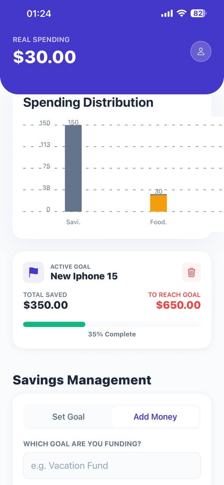
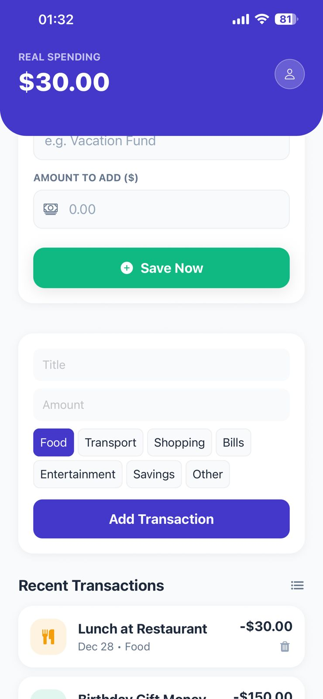
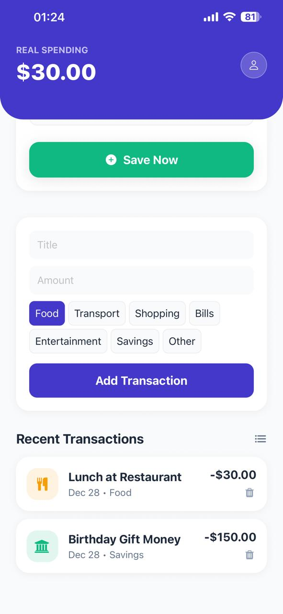

# 💰 Expense & Savings Tracker

A professional-grade mobile application built with **React Native (Expo)** and **Firebase Cloud Firestore**. This app empowers users to manage daily expenses and track long-term savings goals with real-time data persistence and visual progress analytics.

---

## 📱 App Preview

| Dashboard & Analytics | Savings Goal Tracker | Transaction History |The history of the guards|
| :---: | :---: | :---: | :---: |
|  |  |  |  |

---

## 🚀 Key Features

* **Real-time Cloud Sync:** Instant data persistence with Firebase Firestore.
* **Goal-Oriented Savings:** Set specific financial targets and track your progress automatically.
* **Smart Categorization:** Expenses tagged as "Savings" automatically update your active goal progress.
* **Visual Analytics:** Dynamic spending distribution charts for better financial insights.
* **Modern UI:** Built with a clean design system including custom shadows and rounded layouts.

---

## 🛠️ Technical Stack

* **Frontend:** React Native (Expo)
* **Backend:** Firebase Firestore (Cloud Database)
* **State Management:** Context API with Real-time Listeners
* **Icons & UI:** Ionicons, FontAwesome, Expo Vector Icons
* **Charts:** React Native Chart Kit
---

## 📥 Installation & Setup

### 1. Clone the repository
```bash
git clone <your-repository-link>
cd expense-tracker-app

### 2. Install Dependencies
npm install

### 3. Configure Environment Variables

- Create a .env file in the root directory and add your Firebase credentials:
EXPO_PUBLIC_FIREBASE_API_KEY=your_api_key
EXPO_PUBLIC_FIREBASE_AUTH_DOMAIN=your_project.firebaseapp.com
EXPO_PUBLIC_FIREBASE_PROJECT_ID=your_project_id
EXPO_PUBLIC_FIREBASE_STORAGE_BUCKET=your_project.appspot.com
EXPO_PUBLIC_FIREBASE_MESSAGING_SENDER_ID=your_id
EXPO_PUBLIC_FIREBASE_APP_ID=your_app_id


### 4. **Firestore Security Rules**

- To enable data synchronization, ensure your Firebase database rules allow read/write access (Development Mode):
  rules_version = '2';
  service cloud.firestore {
      match /databases/{database}/documents {
        match /{document=**} {
          allow read, write: if true; 
        }
      }
    }


5. **Start the App**

  npx expo start


## 👥 Credits

* **Developed by:** Rinesa Bislimi ❤️
* **Mentor:** Professor Agon Bajgora
* **Purpose:** Final Project for Financial Management Systems

*Helping you achieve financial freedom through better tracking.*